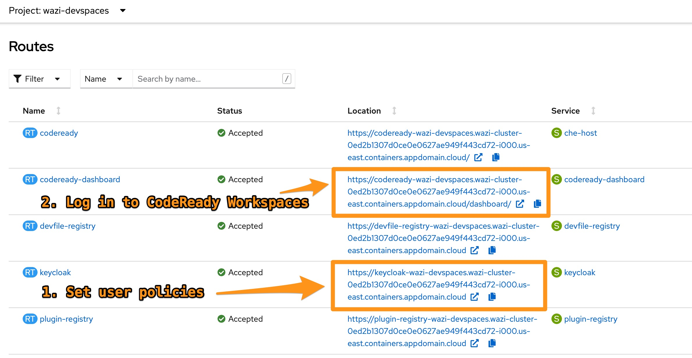
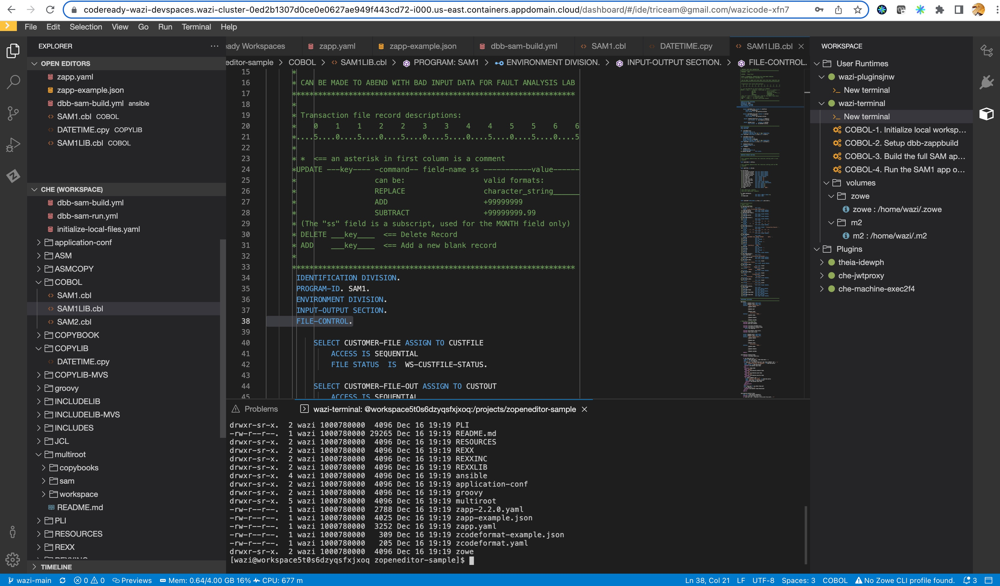
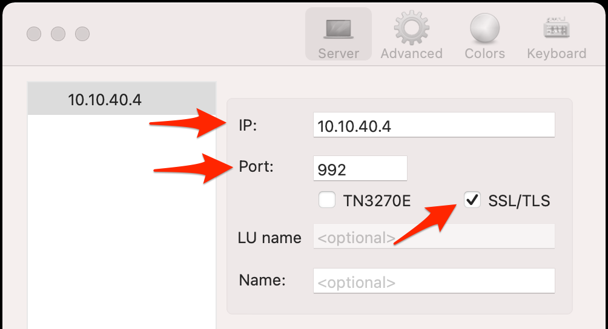

# TechZone Automation - IBM Cloud z/OS Development Reference Architecture

### Change Log

- **12/2022** - Wazi Dev Spaces installation in OCP
- **06/2022** - Initial release

Use this content to deploy IBM Wazi for Dev Spaces onto an existing OpenShift cluster, or to provision IBM Z, Virtual Servers and/or OpenShift clusters.

> This collection of IBM Cloud terraform automation bundles has been crafted from a set of [Terraform modules](https://modules.cloudnativetoolkit.dev/) created by the IBM Ecosystem Lab team part of the [IBM Ecosystem organization](https://www.ibm.com/partnerworld/public?mhsrc=ibmsearch_a&mhq=partnerworld). Please contact **Matthew Perrins** __mjperrin@us.ibm.com__, **Sean Sundberg** __seansund@us.ibm.com__, or **Andrew Trice** __amtrice@us.ibm.com__ for more details or raise an issue on the repository for bugs or feature requests.

The automation supports the provisioning of an IBM Cloud z/OS Development Environment using isolated VPC networks and OpenShift with a set of developer tools formulated an SDLC for native z/OS development with CICS and DB2.

Within this repository you will find a set of Terraform template bundles that embody best practices for provisioning and configuring cloud resources in an IBM Cloud cloud account. We recommend using this with an IBM Cloud [Enterprise sub-account](https://cloud.ibm.com/docs/account?topic=account-what-is-enterprise).

This `README.md` describes the SRE steps required to provision an environment that will scan cleanly with the Security and Compliance Centers NIST based profiles.

> The Security and Compliance scan currently has a set of known [exceptions](#exceptions) see below.

This suite of automation can be used for a Proof of Technology environment, or used as a foundation for production workloads with a fully working end-to-end cloud-native environment. The base environment provides a collection of shared services, an edge network, a management network, and a workload network. This automation contains includes OpenShift Developer Tools from the [Cloud-Native Toolkit project](https://cloudnativetoolkit.dev/)

--- 

If choosing to create new infrastructure, the following services on IBM Cloud will be provisioned:
**Shared services**

- IBM Key Protect _- For the highest level of security, you can also use a Hyper Protect Crypto Service_ instance
- IBM Log Analysis
- IBM Monitoring
- Activity Tracker
- Certificate Manager

**Network VPC**

- Client to Site VPN server or Site to Site VPN Gateway
- Virtual Server Instance running IBM Z, LinuxONE (S390x Architecture)  
- Red Hat OpenShift cluster with SDLC tools provided from the [Cloud-Native Toolkit](https://cloudnativetoolkit.dev/)

**Developer Tools installed into OpenShift**

- OpenShift Pipelines (Tekton)
- OpenShift GitOps (ArgoCD)
<!-- - Artifactory
- SonarQube
- Swagger Editor
- Developer Dashboard ( Starter Kits Code Samples ) -->
- Pre-validated Tekton Pipelines and Tasks
- CLI Tools to assit pipeline creation
- [Wazi Dev Spaces](https://www.ibm.com/docs/en/cloud-paks/z-modernization-stack/2022.4?topic=code-option-1-developing-wazi-dev-spaces)


The following diagram gives a visual representation of the what your IBM Cloud account will contain after the automation has been successfully executed.

## Reference Architecture


Automation is provided in following Terraform packages that will need to be run in order. The bundles have been created this way to give the SRE team the most flexibility possible when building infrastructure for a project.

## Automation Stages

Clone this repository to access the automation to provision this reference architecture on the IBM Cloud. This repo contains the following defined _Bill of Materials_ or **BOMS** for short. They logically build up to deliver a set of IBM Cloud best practices. The reason for having them separate at this stage is to enable a layered approach to success. This enables SREs to use them in logical blocks. One set for Shared Services for a collection of **Network VPC**, **Development VPC**  that maybe installed in separate regions.

### z/OS Development Environment 

| BOM ID | Name                                                                                        | Description                                                                                                                                             | Run Time |
|--------|---------------------------------------------------------------------------------------------|---------------------------------------------------------------------------------------------------------------------------------------------------------| -------- |
| 100    | [100 - IBM z/OS Dev Shared Services](./100-ibm-zdev-shared-services)                        | Provision a set of common cloud managed services that can be shared with **Network** and **Development** VPCs                                           | 5 Mins   |
| 110    | [110 - IBM z/OS Dev Network VPC](./110-ibm-zdev-edge-vpc)                                   | Provision an **Network VPC** with Client to Site VPN & Bastion                                                                                          | 10 Mins  |
| 120    | [120 - IBM z/OS Dev Development VPC no OpenShift](./120-ibm-zdev-development-vpc) | Provision a **Development VPC** with IBM Z Virtual Server and connect to Transit Gateway                                                                | 45 mins  |
| 130    | [130 - IBM z/OS Dev Development OpenShift Cluster](./130-ibm-zdev-development-vpc-openshift) | Provision a **Development VPC** with IBM Z Virtual Server, Red Hat OpenShift Cluster and connect to Transit Gateway                                     | 45 mins  |
| 160    | [160 - IBM z/OS Dev Developer Tools Cluster](./160-ibm-zdev-openshift-dev-tools)            | Provision a set of common CNCF developer tools into Red Hat OpenShift to provide a DevSecOps SDLC that support industry common best practices for CI/CD | 20 mins  |
| 165    | [160 - IBM z/OS Dev Developer Tools for an existing Cluster](./165-ibm-openshift-wazi-dev-tools)            | Deploy IBM Wazi for Dev Spaces into an existing OpenShift cluster on any cloud. | 15 mins  |

### Configuration guidance

There are a couple of things to keep in mind when preparing to deploy the architectures that will impact the naming conventions:

#### Creating multiple instances 

If you are planning to create multiple instances of the Development architecture in the same account, the following must be accounted for:

- Each deployment should use different values for `name_prefix` to keep the resources isolated

## Prerequisites

If creating new infrastructure, the following prerequisites are required:

1. Have access to an IBM Cloud Account, Enterprise account is best for workload isolation but if you only have a Pay Go account this set of terraform can be run in that level of account.

2. Download OpenVPN Client from https://openvpn.net/vpn-server-resources/connecting-to-access-server-with-macos/#installing-a-client-application for your client device, this has been tested on MacOS

3. At this time the most reliable way of running this automation is with Terraform in your local machine either through a bootstrapped docker image or with native tools installed. We provide a Container image that has all the common SRE tools installed. [CLI Tools Image,](https://quay.io/repository/ibmgaragecloud/cli-tools?tab=tags) [Source Code for CLI Tools](https://github.com/cloud-native-toolkit/image-cli-tools)

If deploying Wazi for Dev Spaces into an existing cluster, please make sure your cluster meets the minimum requirements:
https://www.ibm.com/docs/en/cloud-paks/z-modernization-stack/2022.4?topic=admin-requirements

## Setup

### Key Management

The first step in the infrastructure automation is to provision a Key Management service instance.  By default, this Terraform automation will provision an instance of the Key Protect key management service.  Optionally, you can provision a Hyper Protect Crypto Services instance into the nominated account and initialise the key ceronmony by changing the `kms_service` tfvar value to `hpcs`. You can do this with the following automation. We recommend to follow the product docs to perform the quick initialization.

[Hyper Protect Cyrpto Service Documentation](https://cloud.ibm.com/docs/hs-crypto?topic=hs-crypto-get-started)

For proof of technology environments we recommend using the `auto-init` feature. [Auto Init Documentation](https://cloud.ibm.com/docs/hs-crypto?topic=hs-crypto-initialize-hsm-recovery-crypto-unit)

### Terraform IasC Automation

1. Clone this repository to your local SRE laptop or into a secure terminal. Open a shell into the cloned directory. 
2. Determine which reference architecture you will be deploying. There are currently two options available:
   - `vpc`: IBM Cloud - VPC with virtual servers reference architecture
   - `ocp`: IBM Cloud - VPC with Red Hat OpenShift reference architecture
   - `existing`: Will copy the terraform bundles for deploying Wazi for Dev Spaces into an existing OpenShift cluster
3. Run the `setup-workspace.sh -a {ARCH}` script to create a copy of the Terraform scripts in a `/workspace/current` directory and generate the SSH keys needed for the various VSI instances.
   ```
   ./setup-workspace.sh -a ocp
   ```
4. Update **terraform.tfvars** in the `/workspace/current` directory with the appropriate values for your deployment. Note: The values are currently set up to provision all resources in a single resource groups. These can be changed to all use separate resources groups for common services, network, and development resources, if desired.

## Terraform Apply

There are two methods of deployment: automatic or manual:

### Set up credentials

1. Copy `credentials.template` to `credentials.properties`.
2. If creating VSI or OpenShift infrastructure, then you will need to provide your IBM Cloud API key as the value for the `ibmcloud_api_key` variable in `credentials.properties` (**Note:** `*.properties` has been added to `.gitignore` to ensure that the file containing the apikey cannot be checked into Git.)
3. If you are deploying IBM Wazi for Dev Spaces into an existing cluster, you will need to provide credentials into `server_url` and `cluster_login_token` in the `credentials.properties` file.  
  - From you OpenShift console click on top right menu and select Copy login command and click on Display Token
  - Copy the API Token value into the cluster_login_token value
  - Copy the Server URL into the server_url value, only the part starting with https

### Automatically apply the entire solution

User the `./apply-all.sh` script to deploy all components of this solution automatically.  This will deploy all layers of the solution, and automatically connect to the VPN to install development tools in the OpenShift cluster.  If you chose this option, skip ahead to the **Connecting to VPN** section to connect your local machine to the VPN instance..

### Manually apply each architecture in the solution

1. From the root of the cloned repository directory, run `./launch.sh`. This will start a docker container that contains the required libraries to run the terraform scripts.

   > This `launch.sh` currently has a dependency on Docker Desktop we are working on alternative solution. 

2. The container should have opened in the `/terraform` as the working directory which should be mounted from repository directory on the host.  ⚠ Be sure to change to the `/workspace/current` directory.
3. Change directory to the terraform layer that will be applied (e.g. `100-common-services`)
4. Initialize the environment with `terraform init`
5. Apply the terraform with `terraform apply -auto-approve`. If all is configured properly you should not be prompted again and the terraform should run to completion.
6. It is recommended to run Terraform bundles in this order:
   - `110`
   - `120`|`130` (you should not run both)
   - Connect to the VPN (see instructions below)
   - `160`

> **⚠️ Warning**: You will receive errors when executing `160` if you do not connect to the VPN. The error message will be similar to:
>
> ```
> Error: Error downloading the cluster config [mgmt-cluster]: Get "https://c109-e.private.us-east.containers.cloud.ibm.com:30613/.well-known/oauth-authorization-server": dial tcp 166.9.24.91:30613: i/o timeout
> ```
>
> If you then connect to the VPN and attempt to re-run the terraform template, you will then receive an error similar to:
>
> ```
> Error: Kubernetes cluster unreachable: invalid configuration: no configuration has been provided, try setting KUBERNETES_MASTER environment variable
> ```
>
> To get around this issue:
>
> 1. Make sure you are connected to the VPN
> 2. Delete the `terraform.tfstate` file
> 3. Re-run the `terraform apply` command


## Connecting to VPN

When provisioning infrastructure on IBM Cloud, the `110-ibm-zdev-network-vpc` layer creates a VPN that you can use to connect to the private VPC network.  During execution of this layer, a client-side VPN profile will also be created.  You can use this with the [OpenVPN](https://openvpn.net/vpn-server-resources/connecting-to-access-server-with-macos) client to connect your computer to the VPN service.

To connect to vpn:

1. While inside the container (`launch.sh`), `cd` into the `/workspaces/current/110-ibm-zdev-network-vpc` folder.
2. Copy the vpn profile to the `/terraform` directory. The default file name is `edge-vpn-vpn.ovpn`, however this can change depending upon the input variables you specified for `terraform` execution.  The The vpn profile can be easily identified because it will always have a `.ovpn` extension.
3. Exit the container by running the `exit` command.
4. In the `automation-ibmcloud-infra-zos-dev` folder (root of this project), find the vpn profile.
5. From your local operating system, use the vpn profile to connect the OpenVPN client to the VPN server.

## Accessing Wazi Dev Spaces

IBM® Wazi for Dev Spaces provides z/OS® application development capabilities in the OpenShift® Container Platform environment, on top of CodeReady Workspaces.  Wazi Dev Spaces will take approximately 15 minutes to complete installation on a fresh OpenShift cluster.  You can monitor Wazi Dev Spaces installation using the ArgoCD/OpenShift GitOps console.

**This is only installed if you choose the `ocp` installation option when running the `setup-workspace.sh` script.**

Once installation is complete, follow these steps to access Wazi Dev Spaces:

1. Connect to the VPN using the steps above.
2. Go to the OpenShift Dashboard

   

3. Search for the `Route` named `keycloak` in the `wazi-devspaces` project, and click on the url to access Keycloak.  Here you will need to configure user policies.  You can either add users manually, or enable user registration.  
   - The Keycloak login credentials can be found in a secret named `che-identity-secret` in the `wazi-devspaces` project.
4. After setting user login policies, search for the `Route` named `codeready-dashboard` in the `wazi-devspaces` project, and navigate to the route URL.
5. Login to CodeReady Workspaces and start coding!

   


## Connecting to IBM Z, LinuxONE Virtual Server

You can connect to the IBM Z Virtual Server instance using the ssh key that was generated when the VSI was provisioned.

To connect to the IBM Z Virtual Server:

1. Navigate to https://cloud.ibm.com/vpc-ext/compute/vs and find the Z VSI instance that was created.  It will have a name similar to `development-vpc-server00`, but may change depending on the name prefix that was specified in the `terraform.tfvars` file.  Copy the IP address of the VSI.
2. Connect the OpenVPN client
3. Open a command line terminal and navigate to this project's root folder (`automation-ibmcloud-infra-zos-dev`).
4. Use the `./launch.sh` script to launch the automation tools container.
5. Navigate to the layer that created the VSI instance.
   - If you chose the `vpc` architecture, navigate to the `120-ibm-zdev-development-vpc` folder.
   - If you chose the `ocp` architecture, navigate to the `130-ibm-zdev-development-vpc-openshift` folder.

### SSH Connection 
6. Use `ssh` to connect to the VSI instance using the SSH key that was generated for this project.

   ```
   ssh -i ./ssh-zos-vsi ibmuser@<IP ADDRESS>
   ```

   You must use the `ibmuser` username, but be sure to replace the `<IP ADDRESS>` with your VSI's IP address.
7. Once you are connected, you will see terminal output, and can execute the `ls /` command to see the VSI operating system file structure.

   ```
   $ ssh -i ./ssh-zos-vsi ibmuser@10.10.40.4
   IBMUSER : /u/ibmuser : > ls /
   SYSTEM   bin      dev      etc      global   lib      opt      rsusr    samples  tmp      u        usr      var
   IBMUSER : /u/ibmuser : >
   ```
   
#### Reset `ibmuser` password

To connect with a 3270 terminal emulator, you must first reset the password for the `ibmuser` account using the following steps:

1. Connect to the virtual server using `ssh`, using the instructions above.  
2. Run the following command: `tsocmd 'alu ibmuser password(<mypassword>) noexpire'`.  Substitute `<mypassword>` with your actual password.
3. This will change the password for the `ibmuser` account.

### Z Terminal Emulation

You can also connect to the Z VSI instance using the [`tnz`](https://github.com/ibm/tnz) terminal emulator as a 3270 terminal interface.   

⚠️ Before you can use the terminal, you must reset the password for the `ibmuser` account using the instructions above.

1. Follow the installation instructions located at https://github.com/ibm/tnz#installing
2. Add `zti` to your PATH using `export PATH=/home/devops/.local/bin:$PATH`
3. Start the terminal emulator using the `zti` command.
4. Once the 3270 terminal emulator is running, connect to the VSI using `GOTO <IP Address>`, replacing `<IP ADDRESS>` with your VSI's IP address.  For example: `GOTO 10.10.0.4`.
5. Log in using `tso ibmuser` and the password that you set in the previous step.


### Third party 3270 Terminal Emulator

You can also use a third party 3270 terminal emulator such as [Mocha TN3270 Lite](https://apps.apple.com/us/app/mocha-tn3270-lite/id871706308) to connect to your Z/OS Virtual Server instance.  To connect, you must specify your server IP address, port `992`, and make sure to select `SSL/TLS` for the connection settings.




## Resources

- [Introduction to the New Mainframe: z/OS Basics](https://www.redbooks.ibm.com/abstracts/sg246366.html)


## How to Generate this repository from the source Bill of Materials.

This set of automation packages was generated using the open-source [`isacable`](https://github.com/cloud-native-toolkit/iascable) tool. This tool enables a [Bill of Material yaml](https://github.com/cloud-native-toolkit/automation-solutions/tree/main/boms/infrastracture/ibmcloud/zos-dev) file to describe your IBM Cloud architecture, which it then generates the terraform modules into a package of infrastructure as code that you can use to accelerate the configuration of your IBM Cloud environment. Iascable generates standard terraform templates that can be executed from any terraform environment.

> The `iascable` tool is targeted for use by advanced SRE developers. It requires deep knowledge of how the modules plug together into a customized architecture. This repository is a fully tested output from that tool. This makes it ready to consume for projects.

## Uninstalling & Troubleshooting

Please refer to the [Troubleshooting Guide](./TROUBLESHOOTING.md) for uninstallation instructions and instructions to correct common issues.

If you continue to experience issues with this automation, please [file an issue](https://github.com/IBM/automation-ibmcloud-infra-zos-dev/issues) or reach out on our [public Dischord server](https://discord.com/channels/955514069815808010/955514069815808013).

